# NSU Campus Navi 확인용 도식

이 문서는 웹 데모 화면에 포함하지 않는 개발·멘토링 확인용 도식입니다.

## 1. 전체 서비스 구조

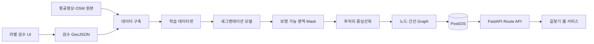

## 2. 저장소 디렉토리 관계

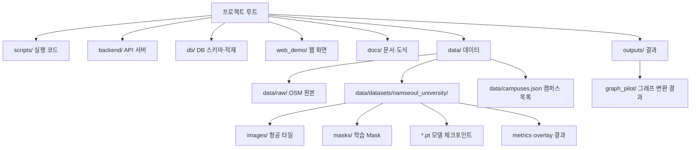

## 3. 데이터 객체와 관계

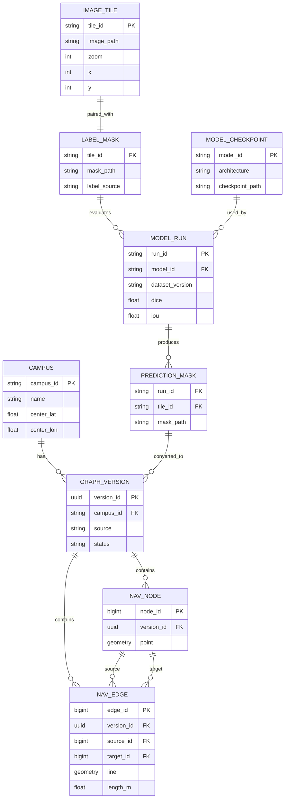

## 4. 학습 데이터 생성 흐름

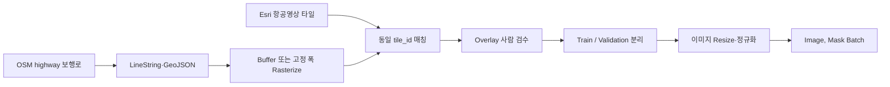

현재 파일럿은 OSM 기반 pseudo-label과 고정 폭 rasterization을 사용하며, 실제 서비스 전에는 GIS 단위의 도로 폭 Buffer와 검수 라벨 재생성이 필요합니다.

## 5. 기본 U-Net 구조

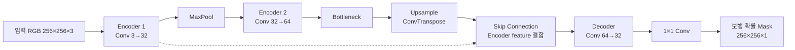

## 6. U-Net + MobileNetV3 전이학습 구조

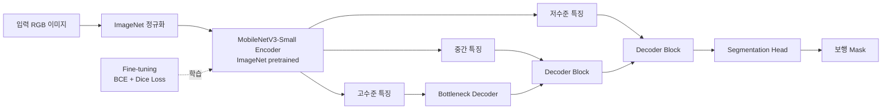

두 모델은 같은 이미지·라벨·epoch·평가 기준으로 비교해야 하며, MobileNetV3 모델만 ImageNet 사전학습 가중치를 사용합니다.

## 7. 학습 루프

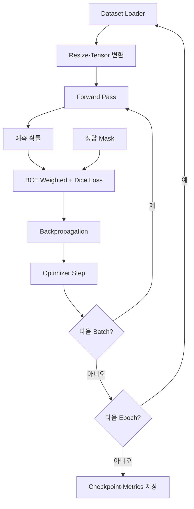

## 8. 학습 전후 예측 비교

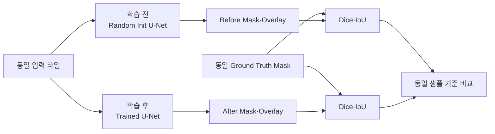

## 9. Mask에서 Graph로 변환

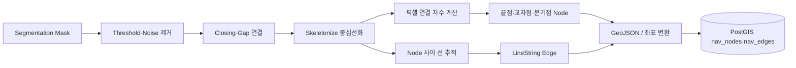

현재 길찾기 서비스의 운영 그래프는 OSM 기반이며, 위 AI Mask→Graph 자동화는 다음 고도화 대상입니다.

## 10. PostGIS·API·웹 서비스 관계

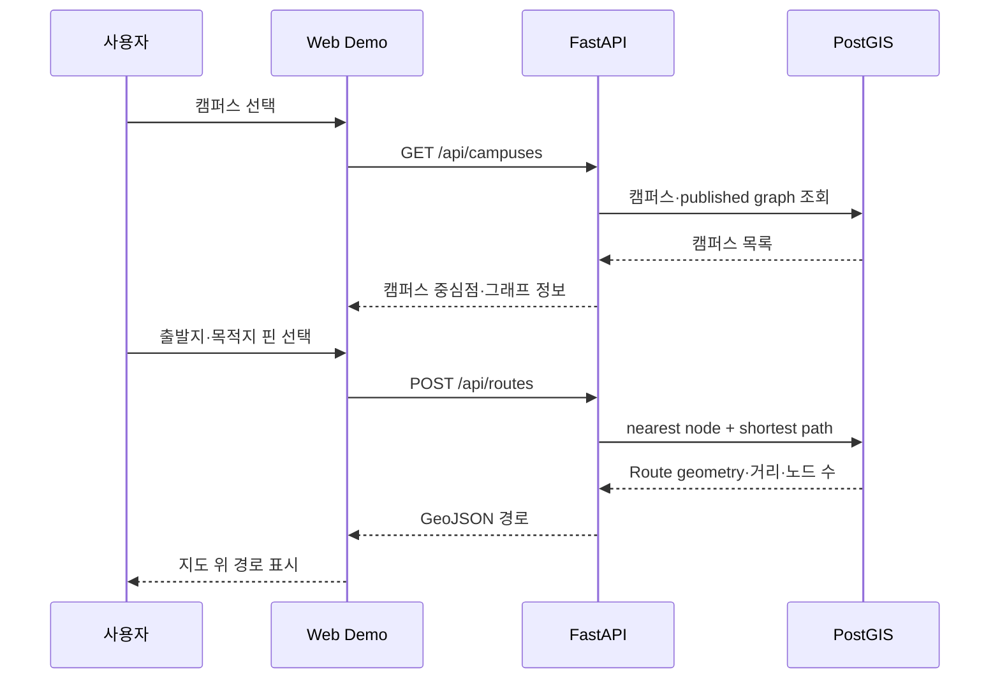

## 11. 현재 구현과 목표 구현

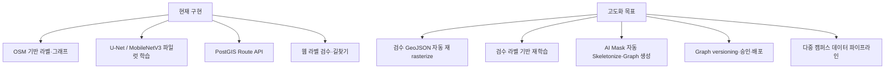
