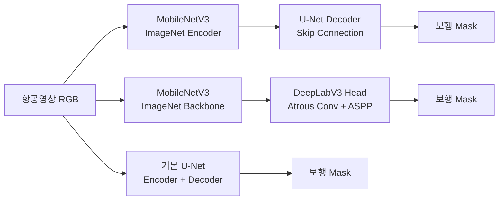
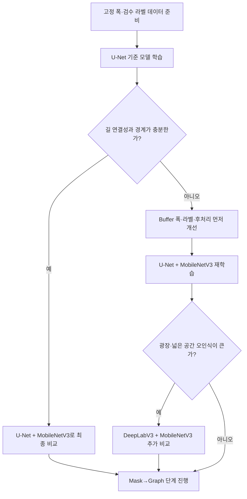

# 세그멘테이션 모델 비교

캠퍼스 보행 가능 영역을 추출하기 위한 세 가지 모델 후보를 비교한다.

## 모델별 비교표

| 구분 | U-Net | U-Net + MobileNetV3 | DeepLabV3 + MobileNetV3 |
|---|---|---|---|
| 기본 구조 | Encoder + Decoder | MobileNetV3 Encoder + U-Net Decoder | MobileNetV3 Backbone + DeepLabV3 Head |
| 핵심 기술 | Skip Connection | Skip Connection + Pretrained Encoder | Atrous Convolution + ASPP |
| 사전학습 활용 | 선택적, 처음부터 학습 가능 | **ImageNet Pretrained 권장** | **ImageNet Pretrained 권장** |
| Transfer Learning | 선택 | **적합** | **적합** |
| 특징 | 단순하고 직관적 | U-Net의 정밀한 복원 + 경량 Encoder | 여러 크기의 공간적 Context 파악 |
| 좁고 긴 보행로 | 좋음 | **매우 적합** | 좋음 |
| 경계·위치 복원 | 좋음 | **좋음** | 보통~좋음 |
| 넓은 광장·도로 | 보통 | 좋음 | **상대적으로 유리** |
| 소규모 데이터 | 가능 | **유리** | 유리 |
| 학습 부담 | 처음부터 학습하면 상대적으로 큼 | **낮음** | 낮음~중간 |
| MacBook 학습 | 가능 | **적합** | 가능 |
| 구현 난이도 | **낮음** | 낮음 | 중간 |

## 모델 구조 도식



## 표준 구현 모델: SMP U-Net

`segmentation_models_pytorch`의 U-Net을 별도 기준 모델로 추가했다. Encoder는 `resnet18`, 가중치는 ImageNet 사전학습, Decoder는 SMP의 표준 U-Net Decoder를 사용한다. 기존 Custom U-Net과 구조·가중치 초기화가 다르므로 별도의 모델 결과로 기록한다.

```bash
uv sync --extra ml
uv run python scripts/train_smp_unet.py
```

생성 파일:

- `data/datasets/namseoul_university/smp_unet_resnet18_imagenet.pt`
- `data/datasets/namseoul_university/smp_unet_resnet18_metrics.json`

SMP U-Net은 표준화된 구현과 pretrained encoder를 사용하므로 Custom U-Net과 비교할 때 동일 샘플·라벨·epoch·threshold를 유지해야 한다.

## 모델별 해석

### U-Net

가장 단순한 기준 모델이다. Encoder가 이미지 특징을 추출하고 Decoder가 원래 해상도로 복원한다. Encoder와 Decoder 사이의 Skip Connection 덕분에 좁은 길과 경계를 복원하기 쉽다.

장점:

- 구현과 디버깅이 쉽다.
- 모델 동작을 설명하기 쉽다.
- 작은 입력과 작은 데이터셋으로 빠르게 기준 결과를 만들 수 있다.

한계:

- 처음부터 학습하면 소규모 데이터에서 일반화가 약할 수 있다.
- 복잡한 배경이나 넓은 광장에 대한 문맥 파악이 제한적일 수 있다.

### U-Net + MobileNetV3

MobileNetV3를 Encoder로 사용하고 U-Net Decoder를 연결한다. MobileNetV3는 ImageNet 사전학습 가중치를 사용해 초기 시각 특징을 확보한다.

장점:

- U-Net의 정밀한 위치 복원 능력을 유지한다.
- MobileNetV3의 경량성으로 MacBook이나 제한된 GPU에서도 실행하기 좋다.
- 소규모 데이터셋에서 Transfer Learning 효과를 기대하기 쉽다.
- 좁고 긴 보행로에 적합하다.

한계:

- Encoder와 Decoder의 feature 해상도 연결을 구현할 때 shape 조정이 필요하다.
- ImageNet 정규화와 사전학습 가중치 설정을 누락하면 비교가 왜곡될 수 있다.

### DeepLabV3 + MobileNetV3

MobileNetV3 Backbone에서 추출한 특징을 DeepLabV3 Head의 Atrous Convolution과 ASPP로 처리한다. 서로 다른 dilation rate를 사용해 여러 크기의 공간적 문맥을 본다.

장점:

- 넓은 광장과 복잡한 도로 주변을 판단하는 데 상대적으로 유리하다.
- 다양한 크기의 객체와 공간 문맥을 함께 반영할 수 있다.
- ImageNet 사전학습 Backbone을 활용할 수 있다.

한계:

- U-Net보다 구현과 feature 연결 구조가 복잡하다.
- 좁은 길의 정밀한 경계를 복원하는 성능은 데이터와 decoder 설정에 영향을 많이 받는다.
- 소규모 파일럿에서는 추가 복잡도 대비 이득이 작을 수 있다.

## 현재 파일럿 적용 순서



## 공정한 비교 조건

세 모델을 비교할 때는 모델 구조만 바꾸고 나머지 조건을 동일하게 유지해야 한다.

- [ ] 동일한 입력 타일
- [ ] 동일한 Ground Truth Mask
- [ ] 동일한 Train/Validation 분할
- [ ] 동일한 Resize와 이미지 정규화 기준
- [ ] 동일한 epoch 수 또는 Early Stopping 기준
- [ ] 동일한 threshold
- [ ] 동일한 평가 지표: Dice, IoU, Precision, Recall
- [ ] 동일한 평가 샘플
- [ ] 학습 시간과 추론 시간을 별도로 기록

## 평가 시 확인할 오류 유형

| 오류 유형 | 확인할 내용 |
|---|---|
| 길 끊김 | 좁고 긴 보행로가 중간에서 단절되는가? |
| 과대 확장 | 잔디·건물·차도까지 보행 영역으로 판단하는가? |
| 경계 왜곡 | 실제 보행 영역의 폭과 경계가 맞는가? |
| 광장 오인식 | 넓은 공간을 지나치게 채우거나 누락하는가? |
| 연결 오류 | 실제 연결되지 않은 보행로를 하나의 영역으로 연결하는가? |
| 그래프 영향 | Skeletonize 후 불필요한 Node·Edge가 증가하는가? |

## 현재 프로젝트의 비교 기준

현재 구현된 비교는 다음 두 모델을 대상으로 한다.

- 기본 U-Net
- ImageNet 사전학습 MobileNetV3를 Encoder로 사용하는 U-Net

관련 실행 코드:

```bash
uv run python scripts/train_unet.py
uv run python scripts/train_mobilenet_full.py
uv run python scripts/compare_models.py
```

DeepLabV3 + MobileNetV3는 현재 비교 후보이자 다음 실험 대상이다. 기본 U-Net과 U-Net + MobileNetV3의 연결성·경계 품질이 충분하지 않거나, 넓은 광장 영역에서 오류가 반복될 때 추가하는 것이 적합하다.

## 모델 선택 결론

현재 파일럿의 1차 선택은 **U-Net + MobileNetV3**가 적합하다. 좁고 긴 캠퍼스 보행로를 복원하면서도 ImageNet Transfer Learning과 경량 추론을 사용할 수 있기 때문이다.

다만 최종 선택은 모델 이름이 아니라 다음 결과로 결정한다.

```text
검수 라벨 기준 Dice·IoU
+ 보행로 연결성
+ 경계 품질
+ 광장 오인식
+ 학습·추론 시간
+ Mask→Graph 변환 안정성
```
